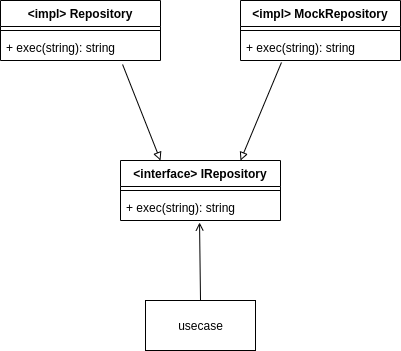

interface-implements
===

[](https://github.com/yglukhov/nimble-tag)


There are two ways to achieve polymorphism in Nim. One is to create `tuple` and another is `dynamic dispatch`.

**tuple**
```nim
type IRepository* = tuple
  exec: proc(msg:string):string
```

```nim
type Repository* = object

proc exec(self:Repository, msg:string):string =
  return &"Repository {msg}"

converter toInterface*(self:Repository):IRepository =
  return (
    exec: proc(msg:string):string = self.exec(msg)
  )
```

**dynamic dispatch**
```nim
type IRepository* = object of RootObj

method exec(self:IRepository, msg:string):string {.base.} = raise newException(CatchableError, "error")
```

```nim
type Repository* = object of IRepository

method exec(self:Repository, msg:string):string =
  return &"Repository {msg}"
```

## install

```sh
nimble install interface_implements
```

## implements
`implements` macro creates `toInterface` converter.

```nim
import interface_implements

implements Repository, IRepository:
  proc func1(self:Repository, msg:string):string =
    return "Repository1 " & msg

  proc func2(self:Repository, number:int):string =
    return "Repository2 " & $number
```
This is converted to bellow.

```nim
proc func1(self:Repository, msg:string):string =
  return "Repository " & msg

proc func2(self:Repository, number:int):string =
  return "Repository2 " & $number

converter toInterface*(self:Repository):IRepository =
  return (
    func1: proc(msg:string):string = self.func1(msg),
    func2: proc(number:int):string = self.func2(number)
  )
```

### API
```nim
macro implements*(implName, interfaceName, procs:untyped):untyped
```

### Example
repository_interface.nim
```nim
type IRepository* = tuple
  exec: proc(msg:string):string
```

mock_repository.nim
```nim
import interface_implements
import ./repository_interface

type MockRepository = ref object

proc newMockRepository*():MockRepository =
  return MockRepository()

implements MockRepository, IRepository:
  proc exec(self:MockRepository, msg:string):string =
    return "MockRepository " & msg
```

repository.nim
```nim
import interface_implements
import ./repository_interface

type Repository = ref object

proc newRepository*():Repository =
  return Repository()

implements Repository, IRepository:
  proc exec(self:Repository, msg:string):string =
    return "Repository " & msg
```

usecase.nim
```nim
import ./repository_interface

type Usecase = ref object
  repository: IRepository

func newUsecase*(repository:IRepository):Usecase =
  return Usecase(repository:repository)

proc exec*(self:Usecase, msg:string):string =
  return self.repository.exec(msg)
```

presentation layer
```nim
block:
  let repository = newMockRepository()
  let usecase = newUsecase(repository)
  assert "MockRepository mock" == usecase.exec("mock")

block:
  let repository = newRepository()
  let usecase = newUsecase(repository)
  assert "Repository exec" == usecase.exec("exec")
```

## interfaceDef
`interfaceDef` macro creates `method` of fields of Object.
This is only available in Nim 2.0.0 and above.


```nim
import interface_implements

interfaceDef:
  type IRepository* = object of RootObj
    exec: proc(self:IRepository, msg:string):string
```
This is converted to bellow.

```nim
type IRepository* = object of RootObj

method exec(self:IRepository, msg:string):string {.base.} = raise newException(CatchableError, "Implementation exec of IRepository is not found")
```


### API
```nim
macro interfaceDefs*(body:untyped):untyped
```

### Example

repository_interface.nim
```nim
interfaceDef:
  type IRepository* = object of RootObj
    exec: proc(msg:string):string
```

mock_repository.nim
```nim
import interface_implements

type MockRepository = object of IRepository

proc newMockRepository*():MockRepository =
  return MockRepository()

method exec*(self:MockRepository, msg:string):string =
  return "MockRepository " & msg
```

repository.nim
```nim
import interface_implements

type Repository = object of IRepository

proc newRepository*():Repository =
  return Repository()

method exec*(self:Repository, msg:string):string =
  return "Repository " & msg
```

usecase.nim
```nim
import ./repository_interface

type Usecase = object
  repository: IRepository

func newUsecase*(repository:IRepository):Usecase =
  return Usecase(repository:repository)

proc exec*(self:Usecase, msg:string):string =
  return self.repository.exec(msg)
```

presentation layer
```nim
block:
  let repository = newMockRepository()
  let usecase = newUsecase(repository)
  assert "MockRepository mock" == usecase.exec("mock")

block:
  let repository = newRepository()
  let usecase = newUsecase(repository)
  assert "Repository exec" == usecase.exec("exec")
```

---

Both pattern achieve structure as bellow.

